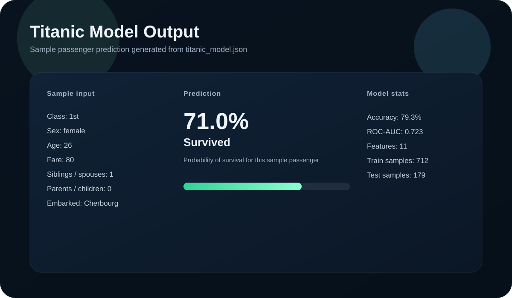

# Titanic Survival Predictor

This project trains a simple Titanic survival model and serves a small browser app that lets you enter passenger details and see a prediction.

## What’s in the project

- `titanic.csv` - the dataset used to train the model.
- `titanic_model.py` - trains the logistic regression model and exports `titanic_model.json`.
- `titanic_model.json` - the saved model artifact with the learned coefficients, scaling values, and metrics.
- `titanic_ml_app.html` - the frontend where you enter passenger details and get a prediction.
- `model_output.svg` - a visual sample of the model output.

## How to train the model

1. Open a terminal in this folder.
2. Run:

```bash
python titanic_model.py
```

This reads `titanic.csv`, trains the model, prints the evaluation results, and writes `titanic_model.json`.

## How to open the website locally

1. Start a local server in this folder:

```bash
python -m http.server 8000
```

2. Open the app in your browser:

```text
http://localhost:8000/titanic_ml_app.html
```

3. Fill in the form or click **Load sample passenger**.
4. Click **Predict survival** to see the result.

## What the website shows

- A short header with the model summary.
- A passenger form for the model inputs.
- A prediction card showing survival probability.
- The most influential feature contributions for that prediction.

## Sample output image



## Notes

- If the browser blocks loading the page directly, use the local server URL above.
- If you retrain the model, `titanic_model.json` will be refreshed automatically.
